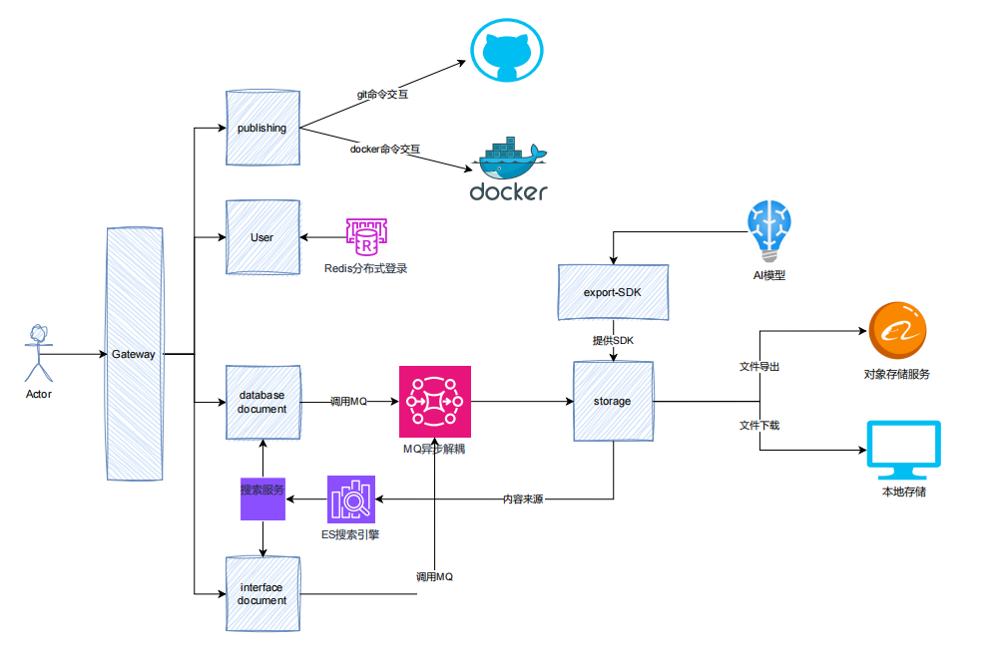

# MRMP
SEEKCY新员工课题-微服务发布管理平台-基于SpringCloud+RockctMQ+ElasticSearch微服务项目

## 技术栈
- SpringBoot
- SpringCloud
- Nacos
- MybatisPlus
- ElasticSearch
- RoctetMQ
- Knife4j
- Swagger
- Redis
- Mysql
- Docker
- Gateway
- OSS
- Dubbo
- Minio
- JGit
- JavaDoc
- Cli
- Javac
## 组织架构图V1.0

## 项目结构
**api-user** 用户模块 用户管理 也是主模块（用户管理、系统管理） 

**api-gateway** 网关 前端->网关->转发给用户模块

**api-storage** 文档存储服务 提供RPC服务

**api-document** 文档管理服务 (数据库文档管理、接口文档管理、版本文档管理) RPC调用者

**api-publish** 发布服务

**api-common** 公共模块 [todo 待做]

## 进度明细
| 模块 | 状态  | 描述         | 进度        | 最后更新时间     | last work |
| --- |-----|------------|-----------|------------|-------|
| api-user | 30% | 用户管理、系统管理  | CRUD      | 2024-08-09 |分布式登录|
| api-gateway | 30% | 网关         | 待完善       | 2024-08-07 |流量分发|
| api-storage | 50% | 文档存储服务     | 基础开发完毕    | 2024-08-14 |MinIO 对象存储服务|
| api-document | 30% | 文档管理服务     | 基础开发完毕    | 2024-08-14 |easyWrod|
| api-publish | 30% | 发布服务       | 查看当前git分支 | 2024-08-07 |JGit|
| api-common | 待开发 | 公共服务       | 待开发       | 2024-08-19 |无|

## 产品流程图

## 功能清单附1

## 功能清单附2

